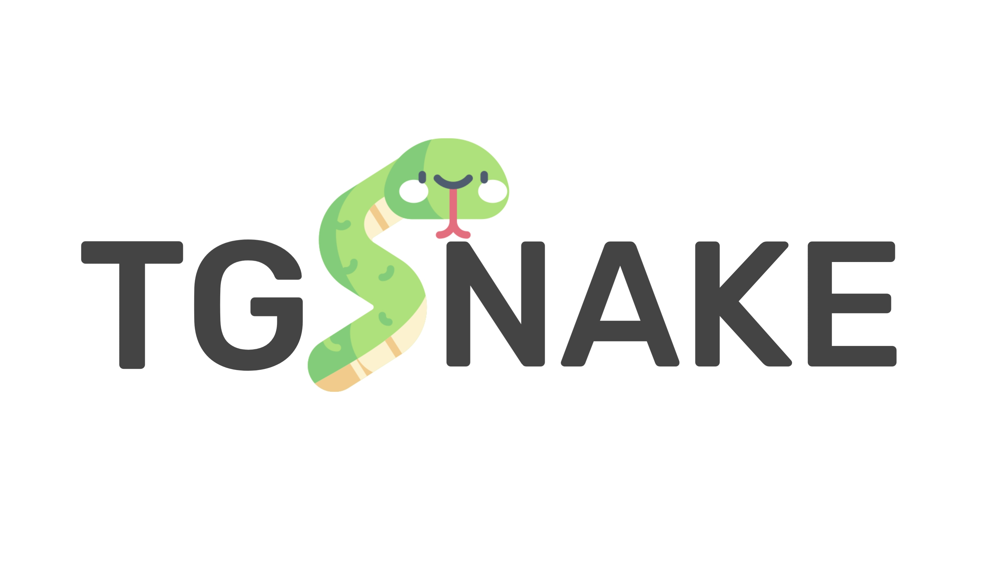

  
Hi, **tgsnake** is a framework developed based on gram.js  
[](https://github.com/butthx/tgsnake)
[](https://t.me/tgsnakechat)  
[](https://t.me/tgsnake)

> WARNING! <br/>
> Maybe your account will be banned if you login using this framework. I don't know what caused it to happen. I am not responsible if your account is banned!

### Example : 

- Installation :  

```bash 
yarn add tgsnake@latest
```
- Simple Hello World :   

```javascript
const {Snake} = require("tgsnake")
// import {Snake} from "tgsnake"
const bot = new Snake({
  apiHash : "abcde", //your api hash
  apiId : 123456, // your api id
  logger:"none" // gramjs logger
})
bot.run() //snake running
bot.on("message",(ctx)=>{ //handle new message event.
  ctx.reply("Hello World") // reply with "Hello World"
  //console.log(ctx) // see json of message.
})
```
More example you can found in example folder or in website.
  
### Contribution  
Welcome, You can contribute to this project. 
#### Guide 
- Fork this repo to your account. 
- Clone your fork repo using git.   
```bash 
git clone <your github repo url> -b "dev"
```
Cloning branch dev in your repo. 
- Edit and make something. 
- Pull new update from branch `dev` original repo (this repo). 
- Push update to your branch `dev` in fork repo.
- Create pull request to branch `dev` original repo from branch `dev` frok repo.
  
### Reference 
- [Pyrogram](https://github.com/pyrogram/pyrogram) 
- [Telethon](https://github.com/LonamiWebs/Telethon) 
- [GramJs](https://github.com/gram-js/gramjs)
- [Telegram Api](https://core.telegram.org/schema) 
- [Grammy](https://github.com/grammyjs/grammyjs)
- [Telegraf](https://github.com/telegraf/telegraf)
  
Thanks to all the frameworks and references that I use, several people who helped in developing this framework that I cannot mention one by one.   
  
Build with ♥️ by [tgsnake dev](https://t.me/tgsnakechat).